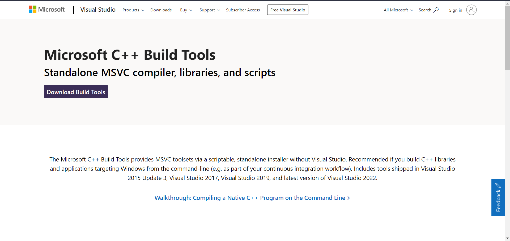

ifdef::env-github[]
:tip-caption: :bulb:
:note-caption: :information_source:
:important-caption: :heavy_exclamation_mark:
:caution-caption: :fire:
:warning-caption: :warning:
endif::[]

= Detectron2 Installation für Windows 10 Betribssystem
:reproducible:
:hide-uri-scheme:

Um Detectron2 zu installieren, sind folgende Schritte nötig:
[WARNING]
====
Vergleichen mit meinem install.txt !
====
* 1. Schritt

Installieren Sie anaconda
https://docs.anaconda.com/anaconda/install/windows/

* 2. Schritt

Öffnen Sie Anaconda Prompt von dem Windows Start-Menu. Wenn Sie Anaconda Prompt nicht finden, dann geben Sie in der Suchleiste folgenden Begriff ein:
[source]
----
Anaconda Prompt
----
* 3. Schritt

Geben Sie folgenden Befehl in Anaconda Prompt, um eine virtuelle Umgebung zu erstellen. Wählen Sie einen Namen z. B. `detectron_env`
[source]
----
conda create -n <detectron_env> python=3.8
----
* 4. Schritt

Aktivieren Sie die virtuelle Umgebung:
[source]
----
conda activate <path to detectron_env>
----
* 5. Schritt

Installieren Sie cudatoolkit
[IMPORTANT]
====
Hinweis: Die Versionsnummer von cuda sollte mit der auf Ihrem Computer installierten Version übereinstimmen (in meinem Fall 11.3. Sie können dies überprüfen, indem Sie "nvcc -V" in das anaconda-Eingabefenster eingeben. Weitere Informationen finden Sie unter https://pytorch.org/.
====
[source]
----
conda install -c anaconda cudatoolkit=11.3
----
* 6. Schritt

Installieren Sie cudnn.
[IMPORTANT]
====
Hinweis. Geben Sie die Versionsnummer nicht an. Sie wird automatisch herausgefunden.
====
[source]
----
conda install -c anaconda cudnn
----
* 7. Schritt

Installieren Sie pywin32:
[source]
----
conda install -c anaconda pywin32
----
* 8. Schritt

Installieren Sie pytorch, torchvision und torchaudio:
[IMPORTANT]
====
Hinweis. Die Versionsnummer von cudatoolkit sollte mit der in Schritt 3 angegebenen übereinstimmen. pytorch wird automatisch mit einer Versionsnummer gleich oder höher als 1.8 installiert, die von detectron2 benötigt wird
====
[source]
----
conda install pytorch torchvision torchaudio cudatoolkit=11.3 -c pytorch
----
* 9. Schritt

Überprüfen Sie, ob ihr GPU für pytorch aktiviert ist.
[source]
----
python
----

[sorce]
----
import torch
type torch.cuda.is_available()
----

und schließlich drücken Sie die Tastenkombination `Strg + z`.
[IMPORTANT]
====
Sie sollten `True` erhalten. Wenn Sie jedoch feststellen, dass GPU für pytorch nicht aktiviert ist, gehen Sie zu Schritt (1) und versuchen Sie es erneut mit anderen Versionsnummern für cuda und/oder python
====
* 10. Schritt

Es müssen folgende Pakete installiert werden:
[IMPORTATNT]
====
Hinweis.

Wenn Git nicht installiert ist, können Sie den folgenden Link benutzen. Bitte beachten Sie, dass Sie die Option `(WEN!) Add a Git Bash Profile to Windows Terminal` im zweiten Schritt aktivieren sollen, damit Sie Git mit durch Anaconda Prompt aufrufen können.
====
Git Installer herunterladen: https://gitforwindows.org/
[source]
----
conda install -c anaconda cython
----
[source]
----
pip install opencv-python
----
[source]
----
conda install -c anaconda pandas
----
[source]
----
conda install -c anaconda numpy
----
[source]
----
pip install git+https://github.com/facebookresearch/fvcore
----
[IMPORTANT]
Um COCO API zu installieren, wird Microsoft Visial C++ Version 14.0 oder höher benötigt. Wenn es nicht installiert ist, bitte den folgenden Link benutzen.
https://visualstudio.microsoft.com/de/visual-cpp-build-tools/

.Laden Sie das Build Tool herunter.

[source]
----
pip install git+https://github.com/philferriere/cocoapi.git#subdirectory=PythonAPI
----
[source]
----
pip install av
----
[source]
----
conda install -c anaconda scipy
----
[source]
----
conda install -c anaconda ninja
----
* 11. Schritt

Wechseln Sie in das Verzeichnis, in dem Sie detectron2 installieren möchten.

* 12. Schritt

Klonen Sie das folgende Repository mit Git:
[IMPOTRANT]
====
Hinweis. Der Ordnername für detectron2 sollte anders lauten als 'detectron2'. In meinem Fall habe ich 'detectron_repository' verwendet. Der Ordnername ist frei wählbar. Ansonsten wird der Pfad für pytorch verwechselt
====
[source]
----
hier mein Link zum Repo
----

* Schritt 13

Installieren Sie die Abhängigkeiten.
[IMPORTANT]
====
Hinweis. Geben Sie nicht das geklonte detectron_repo-Verzeichnis ein.
====
[source]
----
pip install -q -e detectron_repo
----

* 14. Schritt

Wechseln Sie in das Verzeichnis detectron_repo.
[source]
----
cd detectron_repo
----
* 15. Schritt: Bilden Sie Detectron
[source]
----
python setup.py build develop
----
[IMPORTANT]
====
Wenn die oben genannten Schritte nicht erfolgreich sind, müssen Sie möglicherweise von vorne beginnen oder pytorch neu installieren. Wenn Sie pytocrh neu installieren, müssen Sie detectron2 neu erstellen.
====
Wenn die obigen Schritte erfolgreich sind, dann

* 16. Schritt

Testen Sie Detectron2. Gehen Sie zum Verzeichnis demo/ und führen Sie das folgende Skript aus, indem Sie einen Eingabepfad zu einem beliebigen Bild (z. B. .jpg) angeben.
[source]
----
python demo.py --config-file ../configs/COCO-InstanceSegmentation/mask_rcnn_R_50_FPN_3x.yaml --input <path_to_your_image_file.jpg> --opts MODEL.WEIGHTS detectron2://COCO-InstanceSegmentation/mask_rcnn_R_50_FPN_3x/137849600/model_final_f10217.pkl
----

